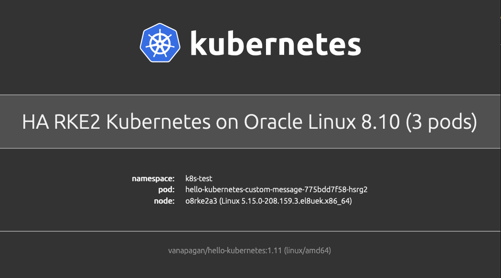

# Hello Kubernetes!

This container image can be deployed on a Kubernetes cluster. It runs a web app, that displays the following:

- a default **Hello world!** message
- namespace, pod, and node details
- container image details



## Quick start

You can deploy `hello-kubernetes` to your Kubernetes cluster using [Helm 3](https://helm.sh/docs/intro/install/). The Helm chart installation and configuration options can be found in the [Deploy using Helm](docs/deploy-using-helm.md) guide.

When running through the following examples, ensure that you are in the chart directory in the repo, since you are referencing a local helm chart.

```bash
cd deploy/helm
```

### Example 1: Default

Deploy the `hello-kubernetes` app into the `hello-kubernetes` namespace with the default "Hello world!" message. The app is exposed via a public Load Balancer on port 80 by default - note that a LoadBalancer service typically only works in cloud provider based Kubernetes offerings.

```bash
helm install --create-namespace --namespace hello-kubernetes hello-world ./hello-kubernetes

# get the LoadBalancer ip address.
kubectl get svc hello-kubernetes-hello-world -n hello-kubernetes -o 'jsonpath={ .status.loadBalancer.ingress[0].ip }'
```

### Example 2: Custom message

Deploy the `hello-kubernetes` app into the `hello-kubernetes` namespace with an "I just deployed this on Kubernetes!" message. The app is exposed via a public Load Balancer on port 80 by default - note that a LoadBalancer service typically only works in cloud provider based Kubernetes offerings.

```bash
helm install --create-namespace --namespace hello-kubernetes custom-message ./hello-kubernetes --set message="This is a test of Kubernetes!"

# get the LoadBalancer ip address.
kubectl get svc hello-kubernetes-custom-message -n hello-kubernetes -o 'jsonpath={ .status.loadBalancer.ingress[0].ip }'
```

### Example 3: Ingress

Deploy the `hello-kubernetes` app into the `hello-kubernetes` namespace. This example assumes that an ingress has been deployed and configured in the cluster, and that the ingress has a path of `/app/hello-kubernetes/` mapped to the `hello-kubernetes` service.

The `hello-kubernetes` app can be reached on the ip address of the ingress via the `/app/hello-kubernetes/` path.

```bash
helm install --create-namespace --namespace hello-kubernetes ingress ./hello-kubernetes \
  --set ingress.configured=true \
  --set ingress.pathPrefix="/app/hello-kubernetes/" \
  --set service.type="ClusterIP"
```
